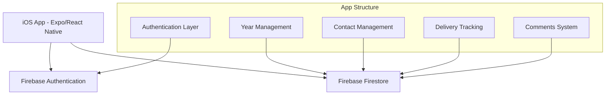

# Design Document

## Overview

The Marketing Checklist app is a React Native mobile application built with Expo that enables marketing professionals to manage yearly contact lists for Improving Inc. employees across different enterprises. The app provides secure authentication, year-based contact organization, delivery tracking with timestamps, and comment management. All data is stored in Firebase Firestore with Firebase Authentication handling user security.

## Architecture

### High-Level Architecture



### Technology Stack

- **Frontend**: Expo SDK with React Native
- **Authentication**: Firebase Authentication
- **Database**: Firebase Firestore
- **State Management**: React Context API with useReducer
- **Navigation**: React Navigation v6
- **UI Components**: React Native Elements or NativeBase
- **Date/Time**: date-fns library

## Components and Interfaces

### Screen Components

#### AuthScreen

- **Purpose**: Handle user authentication (sign in/sign up)
- **Props**: None
- **State**: email, password, loading, error
- **Methods**: handleSignIn(), handleSignUp(), validateInput()

#### YearManagementScreen

- **Purpose**: Manage yearly campaign lists
- **Props**: navigation
- **State**: years[], selectedYear, showAddYear, loading
- **Methods**: addYear(), deleteYear(), renameYear(), selectYear()

#### ContactListScreen

- **Purpose**: Display and manage contacts for selected year
- **Props**: navigation, selectedYear
- **State**: contacts[], loading, showAddContact
- **Methods**: loadContacts(), addContact(), editContact(), deleteContact(), toggleDelivery()

#### ContactFormScreen

- **Purpose**: Add/edit contact information
- **Props**: navigation, contact (optional), isEdit
- **State**: firstName, lastName, enterpriseName, comments, loading
- **Methods**: saveContact(), validateForm(), handleSubmit()

#### ContactDetailScreen

- **Purpose**: View/edit contact details and comments
- **Props**: navigation, contact
- **State**: contact, comments, isEditing, loading
- **Methods**: updateComments(), toggleDelivery(), editContact()

### Service Components

#### AuthService

```typescript
interface AuthService {
  signIn(email: string, password: string): Promise<User>
  signUp(email: string, password: string): Promise<User>
  signOut(): Promise<void>
  getCurrentUser(): User | null
  onAuthStateChanged(callback: (user: User | null) => void): () => void
}
```

#### FirestoreService

```typescript
interface FirestoreService {
  // Year Management
  getYears(userId: string): Promise<Year[]>
  addYear(userId: string, year: Year): Promise<string>
  updateYear(userId: string, yearId: string, updates: Partial<Year>): Promise<void>
  deleteYear(userId: string, yearId: string): Promise<void>
  
  // Contact Management
  getContacts(userId: string, yearId: string): Promise<Contact[]>
  addContact(userId: string, yearId: string, contact: Contact): Promise<string>
  updateContact(userId: string, yearId: string, contactId: string, updates: Partial<Contact>): Promise<void>
  deleteContact(userId: string, yearId: string, contactId: string): Promise<void>
  
  // User Preferences
  getUserPreferences(userId: string): Promise<UserPreferences>
  updateUserPreferences(userId: string, preferences: Partial<UserPreferences>): Promise<void>
}
```

#### StorageService

```typescript
interface StorageService {
  getLastSelectedYear(): Promise<string | null>
  setLastSelectedYear(yearId: string): Promise<void>
  clearStorage(): Promise<void>
}
```

## Data Models

### User Model

```typescript
interface User {
  uid: string
  email: string
  createdAt: Date
  lastLoginAt: Date
}
```

### Year Model

```typescript
interface Year {
  id: string
  userId: string
  name: string // e.g., "2024", "2025"
  createdAt: Date
  updatedAt: Date
}
```

### Contact Model

```typescript
interface Contact {
  id: string
  userId: string
  yearId: string
  firstName: string
  lastName: string
  enterpriseName: string
  comments: string
  delivered: boolean
  deliveredAt: Date | null
  createdAt: Date
  updatedAt: Date
}
```

### UserPreferences Model

```typescript
interface UserPreferences {
  userId: string
  lastSelectedYearId: string | null
  createdAt: Date
  updatedAt: Date
}
```

## Database Schema (Firestore)

### Collection Structure

```
users/{userId}
├── preferences (document)
├── years (subcollection)
│   └── {yearId} (document)
│       └── contacts (subcollection)
│           └── {contactId} (document)
```

### Security Rules

```javascript
rules_version = '2';
service cloud.firestore {
  match /databases/{database}/documents {
    // Users can only access their own data
    match /users/{userId} {
      allow read, write: if request.auth != null && request.auth.uid == userId;
      
      match /years/{yearId} {
        allow read, write: if request.auth != null && request.auth.uid == userId;
        
        match /contacts/{contactId} {
          allow read, write: if request.auth != null && request.auth.uid == userId;
        }
      }
    }
  }
}
```

## Error Handling

### Error Types

- **AuthenticationError**: Invalid credentials, network issues
- **ValidationError**: Invalid form data, missing required fields
- **NetworkError**: Offline state, connection timeouts
- **PermissionError**: Insufficient Firestore permissions
- **NotFoundError**: Requested resource doesn't exist

### Error Handling Strategy

1. **User-Friendly Messages**: Convert technical errors to readable messages
2. **Retry Logic**: Automatic retry for network-related failures
3. **Offline Support**: Queue operations when offline, sync when online
4. **Graceful Degradation**: Show cached data when possible
5. **Error Boundaries**: React error boundaries to catch component errors

### Error Display Components

- **ErrorBoundary**: Catch and display component errors
- **Toast/Alert**: Show temporary error messages
- **ErrorScreen**: Full-screen error display for critical failures

## Testing Strategy

### Unit Testing

- **Services**: AuthService, FirestoreService, StorageService
- **Utilities**: Date formatting, validation functions
- **Hooks**: Custom React hooks for data management
- **Components**: Individual component logic and rendering

### Integration Testing

- **Authentication Flow**: Sign in/up, session management
- **Data Flow**: CRUD operations with Firestore
- **Navigation**: Screen transitions and parameter passing
- **Offline Behavior**: Data persistence and sync

### End-to-End Testing

- **User Workflows**: Complete user journeys from auth to contact management
- **Cross-Platform**: iOS device testing
- **Performance**: App startup, data loading times

### Testing Tools

- **Jest**: Unit and integration testing
- **React Native Testing Library**: Component testing
- **Detox**: End-to-end testing for React Native
- **Firebase Emulator**: Local testing environment

## Performance Considerations

### Data Loading

- **Pagination**: Load contacts in batches for large lists
- **Caching**: Cache frequently accessed data locally
- **Lazy Loading**: Load contact details on demand
- **Optimistic Updates**: Update UI immediately, sync in background

### Memory Management

- **Image Optimization**: Compress and cache images if added later
- **List Virtualization**: Use FlatList for large contact lists
- **Memory Leaks**: Proper cleanup of listeners and subscriptions

### Network Optimization

- **Offline First**: Store data locally, sync when online
- **Batch Operations**: Group multiple Firestore operations
- **Connection Monitoring**: Detect and handle network state changes

## Security Considerations

### Authentication Security

- **Email Validation**: Proper email format validation
- **Password Requirements**: Minimum length and complexity
- **Session Management**: Secure token handling and expiration
- **Biometric Auth**: Optional fingerprint/face ID integration

### Data Security

- **Firestore Rules**: Strict user-based access control
- **Data Validation**: Server-side validation for all inputs
- **Encryption**: Firebase handles data encryption at rest and in transit
- **PII Protection**: Minimal personal data collection

### App Security

- **Code Obfuscation**: Protect source code in production builds
- **Certificate Pinning**: Secure API communications
- **Jailbreak Detection**: Optional security for sensitive deployments
- **Input Sanitization**: Prevent injection attacks in comments
